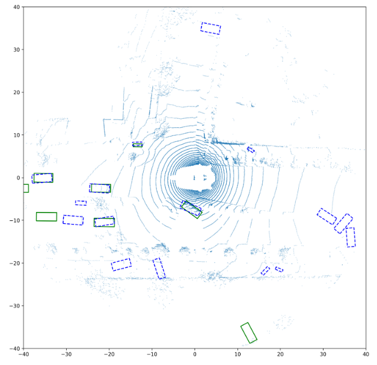

# Point Cloud Processing for Vehicle Detection

In this project, I aim to first implement VoxelNet to explore some backbone encoding strategies for downstream tasks. VoxelNet depends on Voxel Feature Extraction layers to encode the point cloud, which is first voxelized. Next, within each voxel, the points are decorated with other features such as the delta distance to the average center, before going through Point Pillar style processing such as going through MLP, maxpool over the points, concatenating each point feature with the voxel-level feature. 

## Environment

The training script requires the following:  

PyTorch  
Spconv   
einops   

The dataset I used is the [Nuscenes](https://www.nuscenes.org/nuscenes) dataset. Only LiDAR data are needed for now. 

## Preliminary result
Some preliminary training result is shown below. In the figure, the ground truth bounding box for vehicles are shown in green. The prediction made by the model is shown in blue dashed lines. Some of the predictions match with ground truth bounding quite well.

